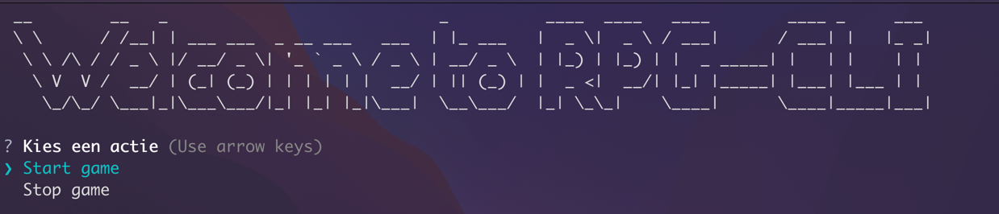

# RPG-CLI

A game about beating the bruzz in a epic RPG CLI game made in Node.js

## Requirements

- Windows, MacOS or Linux
- Node JS & NPM ([install here](https://nodejs.org/en/download))

# Screenshot


# Running game

### From Source (Compile binaries)

1. Clone repository:
    ```bash
    git clone https://github.com/tallandcollege/project-2-command-line-game-EzraSchutte.git
    ```
2. Navigate to project:
    ```bash
    cd project-2-command-line-game-EzraSchutte
    ```
3. Install dependencies:
    ```bash
    npm install
    ```
4. Run the game!
    ```bash
    node .
    ```
   
# Dependencies
- [Figlet](https://www.npmjs.com/package/figlet)
- [Inquirer](https://www.npmjs.com/package/inquirer)
- [Kleur](https://www.npmjs.com/package/kleur)
